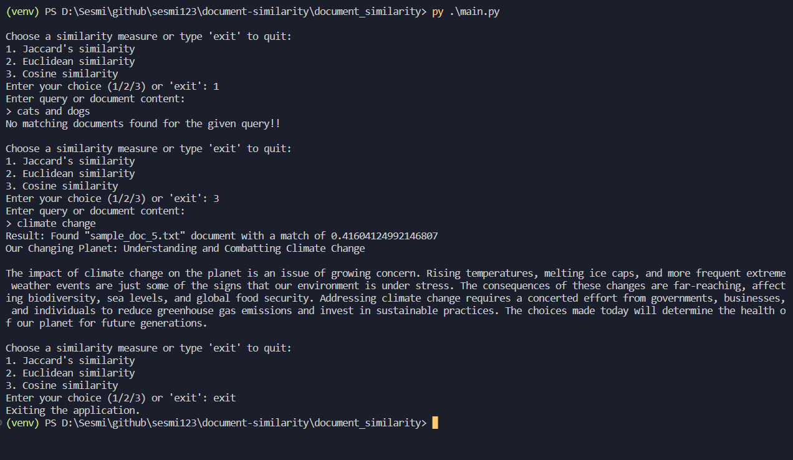

# document-similarity

This project aims to explore and implement various algorithms for measuring the similarity between documents. By leveraging different mathematical approaches, we can determine how closely related two pieces of text are, which has applications in information retrieval, plagiarism detection, and content recommendation systems.

Inspired by: [Evaluating Methods for Calculating Document Similarity](https://www.kdnuggets.com/evaluating-methods-for-calculating-document-similarity)

## Setup

```sh
pip install -r requirements.txt
py nltk_download.py
```

## Example Usage



## Preprocessing

* Tokenization
* Lower casing
* Remove punctuations
* Remove stop words
* Stemming
* Lemmatizing (better than stemming)

## Jaccard's similarity

Jaccard's similarity measures the similarity between two sets. It is defined as the size of the intersection divided by the size of the union of the sample sets.

To calculate Jaccard's similarity between two documents, we first tokenize the documents into sets of unique words and then apply the Jaccard formula.

## Euclidean Similarity

Euclidean similarity uses the Euclidean distance to measure the similarity between two documents. This approach requires representing documents as vectors in a multidimensional space, where each dimension corresponds to a term in the document.

The Euclidean similarity is the inverse of the Euclidean distance between two document vectors.

## Cosine Similarity

Cosine similarity measures the cosine of the angle between two non-zero vectors in a multidimensional space. It is particularly useful in positive space, where the outcome is neatly bounded in [0,1].

## TF-IDF(Term Frequency-Inverse Document Frequency)

TF-IDF is a numerical statistic that reflects how important a word is to a document in a collection or corpus. It is often used as a weighting factor in searches, text mining, and user modeling.

The TF-IDF value increases proportionally to the number of times a word appears in the document and is offset by the number of documents in the corpus that contain the word.

## Bag of Words

The Bag of Words (BoW) model is a simplifying representation used in natural language processing and information retrieval. In this model, a text is represented as the bag (multiset) of its words, disregarding grammar and even word order but keeping multiplicity.

We call vectorization the general process of turning a collection of text documents into numerical feature vectors. This specific strategy (tokenization, counting and normalization) is called the Bag of Words or "Bag of n-grams" representation. Documents are described by word occurrences while completely ignoring the relative position information of the words in the document.


## Doc2Vec

Dataset used is a subset of [10dataset-text-document-classification](https://www.kaggle.com/datasets/jensenbaxter/10dataset-text-document-classification)

The accuracy of the trained model is subpar right now. Need to improve it.


## Sentence similarity features and applications

### Fuzzy string matching

[Reference](https://chairnerd.seatgeek.com/fuzzywuzzy-fuzzy-string-matching-in-python/)

Features that could used to find fuzzy similarity between sentences include:

* string similarity (edit distance)
* partial string similarity
* token sort
* token set

Some of the applications of finding similar sentences are:

* Question Answering Systems: solving Quora question pair similarity problem, 
* Information Retrieval: creating a website for pulling event tickets for a game or show from all over the internet and listing them in a single page, 
* Legal Document Analysis: finding and comparing similar cases or regulations within legal documents to aid in legal research or case preparation, 
* Medical Record Analysis: comparing patient reports and medical records to identify similar cases/treatments/outcomes for better diagnosis and treatment planning etc.